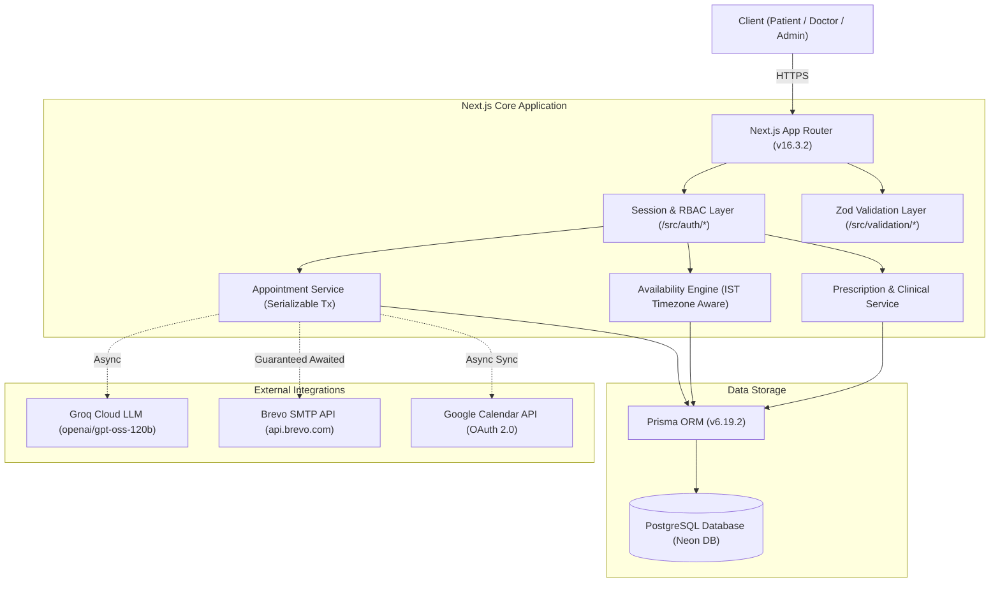

# Healthcare Appointment & Follow-up Manager

[](https://nextjs.org/)
[](https://www.typescriptlang.org/)
[](https://www.prisma.io/)
[](https://tailwindcss.com/)
[](https://nodejs.org/)

A full-stack, enterprise-grade healthcare appointment and clinical follow-up platform built with Next.js 16 (App Router), PostgreSQL (Prisma ORM), Groq AI (Llama 3.3 / GPT-OSS), Brevo Transactional Email, and Google Calendar OAuth 2.0.

- **Production URL**: [https://healthcare-appointment-manager.vercel.app](https://healthcare-appointment-manager.vercel.app)
- **Repository**: [https://github.com/drashya7405/healthcare-appointment-manager](https://github.com/drashya7405/healthcare-appointment-manager)

---

## 1. Project Overview

### Problem Solved
Traditional clinic appointment systems suffer from fragmented communication: patients lack structured pre-visit symptom intake, doctors enter consultations without synthesized clinical briefings, double-bookings occur during concurrent high-traffic slots, and post-visit treatment instructions are easily lost or misunderstood.

### System Purpose
The **Healthcare Appointment & Follow-up Manager** unifies patient scheduling, clinical triage, consultation workflows, post-visit guidance, and calendar synchronization into a reliable, role-isolated platform.

### User Portals
1. **Patient Portal (`/patient/dashboard`)**: Doctor search by specialization, real-time slot selection in Indian Standard Time (IST), symptom submission, booking management, and access to AI-generated post-visit summaries and prescriptions.
2. **Doctor Portal (`/doctor/dashboard`)**: Working hours management, leave scheduling, live patient queue inspection, pre-visit AI triage briefings (urgency levels, chief complaints, 3 suggested clinical questions), clinical note authoring, structured prescription generation, and Google Calendar OAuth synchronization.
3. **Admin Portal (`/admin/dashboard`)**: Doctor onboarding, system-wide appointment oversight, clinical profile management, and transactional email diagnostics.

---

## 2. Demo & Assignment Evaluation Credentials

The system includes pre-seeded demo accounts for assignment evaluation across all three user roles:

| User Role | Full Name | Email Address | Password | Target Dashboard |
| :--- | :--- | :--- | :--- | :--- |
| **ADMIN** | System Administrator | `admin@example.com` | `AdminPass123!` | [`/admin/dashboard`](https://healthcare-appointment-manager.vercel.app/admin/dashboard) |
| **DOCTOR (Cardiology)** | Dr. Sarah Smith | `doctor.smith@example.com` | `DoctorPass123!` | [`/doctor/dashboard`](https://healthcare-appointment-manager.vercel.app/doctor/dashboard) |
| **DOCTOR (Dermatology)** | Dr. Michael Jones | `doctor.jones@example.com` | `DoctorPass123!` | [`/doctor/dashboard`](https://healthcare-appointment-manager.vercel.app/doctor/dashboard) |
| **PATIENT (Example)** | John Doe | `patient.doe@example.com` | `PatientPass123!` | [`/patient/dashboard`](https://healthcare-appointment-manager.vercel.app/patient/dashboard) |

> **Note**: Evaluators can log in using these credentials directly on the [Production Deployment](https://healthcare-appointment-manager.vercel.app/login) or seed them locally using `npx prisma db seed`. New patients can also register freely at [`/register`](https://healthcare-appointment-manager.vercel.app/register).

---

## 3. Key Implemented Features

- **Authentication & RBAC**: Database-backed session tokens (32-byte crypto), bcrypt password hashing (12 salt rounds), strict role boundaries (`PATIENT`, `DOCTOR`, `ADMIN`).
- **Doctor Specialization & Directory**: Filterable doctor catalog with specialization tags, bios, and consultation durations.
- **Working Hours & Availability Engine**: Authoritative slot generation calculated in Indian Standard Time (IST, UTC+05:30) with discrete intervals (15m, 30m, 45m, 60m).
- **Double-Booking Prevention**: Prisma serializable transactions (`timeout: 20s`), concurrent `Promise.all` conflict checks, and PostgreSQL `@@unique([doctorId, startsAt])` constraints guaranteeing zero overlapping bookings.
- **Slot Hold Mechanism Analysis**: Employs atomic check-and-insert transactions eliminating orphaned lock hazards and cart-abandonment denial-of-service states.
- **Doctor Leave Management**: Automated interval blocking for single and multi-day leaves. Conflicting appointments transition to `AFFECTED_BY_LEAVE` and trigger automated patient notification emails.
- **Pre-Visit AI Triage (Groq LLM)**: Asynchronously extracts chief complaints, assigns urgency levels (`LOW`, `MEDIUM`, `HIGH`), and formulates 3 targeted physician questions from patient symptoms.
- **Post-Visit AI Summary**: Translates clinical notes and prescribed medications into patient-friendly explanations with structured dosage schedules.
- **Transactional Email Notifications (Brevo)**: HTML/Text templates for booking confirmations, cancellations, reschedules, doctor leave alerts, and medication reminders.
- **Google Calendar OAuth 2.0**: Two-way consultation synchronization with offline access, automatic token refresh, and event CRUD.
- **Fault-Tolerant Resilience**: Non-blocking failure isolation ensuring external AI, SMTP, or Calendar errors never roll back successful appointment bookings.

---

## 4. System Architecture



---

## 5. Documentation Index

Comprehensive technical documentation is organized in the [`docs/`](./docs/) directory:

- [**Architecture Guide** (`docs/architecture.md`)](./docs/architecture.md): Deep-dive into application layers, service boundaries, and external integration adapters.
- [**API Reference** (`docs/api.md`)](./docs/api.md): Complete specifications for all 27 RESTful route handlers with request/response schemas.
- [**Database Schema** (`docs/database.md`)](./docs/database.md): PostgreSQL ER diagrams, model definitions, foreign keys, and indexes.
- [**Authentication & RBAC** (`docs/authentication.md`)](./docs/authentication.md): Session token mechanics, role guards, and authorization matrices.
- [**AI / LLM Integration** (`docs/ai.md`)](./docs/ai.md): Groq prompt architecture, Zod validation schemas, medical disclaimers, and fallback behavior.
- [**Notifications Subsystem** (`docs/notifications.md`)](./docs/notifications.md): Brevo SMTP integration, templates, idempotency, and serverless lifecycle handling.
- [**Google Calendar Integration** (`docs/google-calendar.md`)](./docs/google-calendar.md): OAuth 2.0 dance, token refresh, and calendar event CRUD.
- [**Deployment Guide** (`docs/deployment.md`)](./docs/deployment.md): Vercel and Neon PostgreSQL setup guide.
- [**Testing & Quality Assurance** (`docs/testing.md`)](./docs/testing.md): Catalog of 125 automated unit and integration tests.
- [**System Design Write-Up** (`docs/system-design.md`)](./docs/system-design.md): Concise architectural analysis (<= 800 words) covering double-booking prevention, leave conflict handling, and reliability.

---

## 6. Local Development Setup

### Prerequisites
- **Node.js**: v20.x or higher
- **PostgreSQL**: Local PostgreSQL instance or remote Neon DB connection
- **npm** / **pnpm** / **yarn**

### Step-by-Step Setup

1. **Clone the Repository**:
   ```bash
   git clone https://github.com/drashya7405/healthcare-appointment-manager.git
   cd healthcare-appointment-manager
   ```

2. **Install Dependencies**:
   ```bash
   npm install
   ```

3. **Configure Environment Variables**:
   Copy `.env.example` to `.env`:
   ```bash
   cp .env.example .env
   ```
   Populate your database URL, Brevo API key, Groq API key, and Google OAuth credentials.

4. **Initialize Database & Prisma Client**:
   ```bash
   npx prisma db push
   npx prisma generate
   ```

5. **Start Local Development Server**:
   ```bash
   npm run dev
   ```
   Open [http://localhost:3000](http://localhost:3000) in your browser.

6. **Run Verification Suite**:
   ```bash
   npm test
   npm run typecheck
   npm run lint
   npm run build
   ```

---

## 7. Test Suite Results

```text
# Tests: 125 passed, 0 failed, 59 suites (npm test)
# Typecheck: tsc --noEmit passed (0 errors)
# Linter: ESLint passed (0 errors)
# Build: Next.js production build succeeded (next build --webpack)
```
