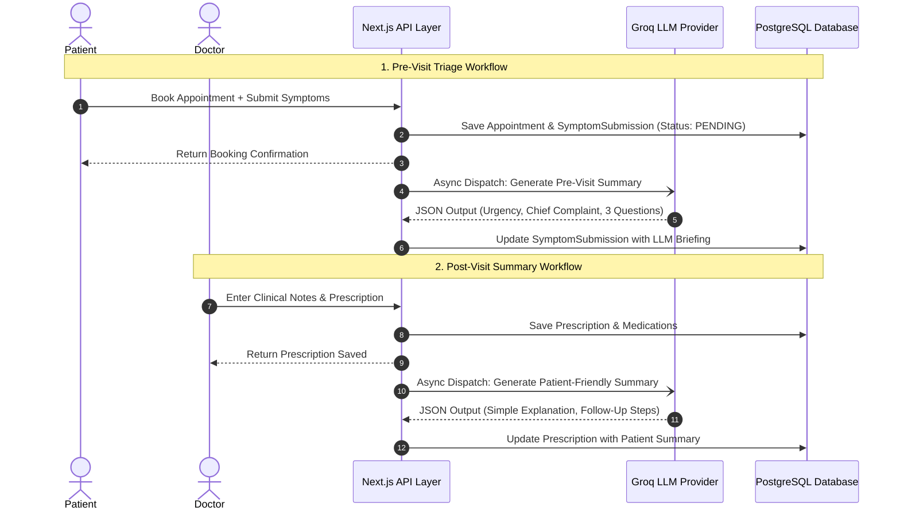

# AI / Large Language Model (LLM) Integration

## Overview & Architecture

The application incorporates artificial intelligence to streamline clinical workflows through two high-impact touchpoints:
1. **Pre-Visit Triage & Briefing**: Synthesizes patient-submitted symptoms into an urgency level (`LOW`, `MEDIUM`, `HIGH`), an extracted chief complaint, and three targeted clinical inquiry questions for the attending physician.
2. **Post-Visit Patient Summary**: Transforms physician clinical notes into clear, patient-friendly health summaries with plain-language medication schedules and actionable follow-up instructions.



---

## Provider & Model Configuration

- **Primary Provider**: Groq Cloud API (`src/lib/ai/providers/groq.ts`) via HTTPS REST endpoint (`https://api.groq.com/openai/v1/chat/completions`).
- **Model**: `openai/gpt-oss-120b` (or `llama-3.3-70b-versatile`).
- **Mock Provider (`src/lib/ai/providers/mock.ts`)**: Built-in deterministic rule-based generator used during automated unit tests or when `AI_PROVIDER="mock"` is active.
- **Environment Variables**:
  ```env
  AI_PROVIDER="groq" # "groq" or "mock"
  GROQ_API_KEY="gsk_..."
  GROQ_MODEL="openai/gpt-oss-120b"
  AI_MOCK_FAILURE="false" # Used for failure isolation testing
  ```

---

## Prompt Architecture & Structured Output Schemas

### 1. Pre-Visit Clinical Triage
- **System Prompt**: Enforces clinical objectivity, medical safety framing, and strict JSON response formatting.
- **User Prompt**:
  ```text
  Analyse these symptoms and return: urgency level (Low / Medium / High), chief complaint, and three suggested questions for the doctor.
  Symptoms: <patient-entered-symptoms>
  ```
- **Zod Validation Schema (`src/lib/ai/types.ts`)**:
  ```ts
  export const preVisitSummarySchema = z.object({
    urgencyLevel: z.enum(["LOW", "MEDIUM", "HIGH"]),
    chiefComplaint: z.string().min(1),
    doctorQuestions: z.array(z.string()).min(1).max(5),
    summary: z.string().min(1),
  });
  ```

### 2. Post-Visit Patient Communication
- **System Prompt**: Directs the LLM to write in empathetic, 6th-grade reading level language while maintaining 100% fidelity to the doctor's instructions.
- **User Prompt**:
  ```text
  Convert these clinical notes into a patient-friendly summary with medication schedule and follow-up steps:
  Clinical Notes: <doctor-entered-notes>
  Prescribed Medications: <medication-list>
  ```
- **Zod Validation Schema (`src/lib/ai/types.ts`)**:
  ```ts
  export const postVisitSummarySchema = z.object({
    patientFriendlySummary: z.string().min(1),
    followUpSteps: z.string().min(1),
  });
  ```

---

## Medical Safety & Isolation Guarantees

1. **Non-Diagnostic Disclaimer**:
   Every AI-generated briefing displays an explicit medical safety notice:
   > *Informational clinical briefing generated by AI to assist consultation preparation. This does not constitute an authoritative diagnosis or definitive medical advice.*
2. **Preservation of Raw Records**:
   Original human inputs (`SymptomSubmission.symptoms` and `Prescription.clinicalNotes`) are stored immutably in PostgreSQL and always displayed to clinicians alongside the AI summary.
3. **Graceful Failure Isolation**:
   If the Groq API experiences rate limits, network timeouts, or invalid JSON output:
   - The error is captured and recorded in `SymptomSubmission.llmFailureMessage` or `Prescription.llmFailureMessage`.
   - **The core appointment, symptom submission, or prescription is NEVER rolled back.** The consultation remains 100% active and accessible.
