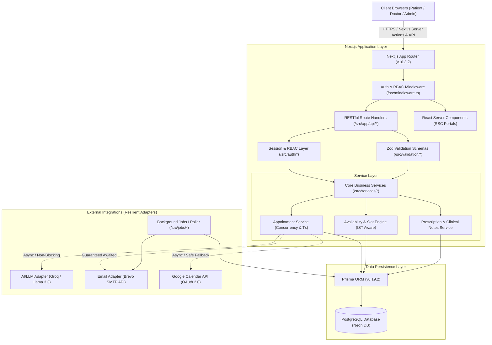

# System Architecture

## Overview

The **Healthcare Appointment & Follow-up Manager** is architected as a modern, full-stack Next.js 16 application running in Node.js runtime environments (both locally and deployed serverlessly on Vercel) paired with an external PostgreSQL database (Neon Serverless Postgres). The system strictly enforces separation of concerns through dedicated service boundaries, domain models, database abstractions via Prisma ORM, and resilient fault-tolerant external integration adapters.

---

## Architectural Layers

---

## Component Breakdown

### 1. Presentation & Routing Layer (`src/app`)
- **Next.js App Router**: Utilizes React Server Components (RSC) for initial page loads and data pre-fetching alongside Client Components (`"use client"`) for interactive interfaces (e.g., date pickers, real-time slot preview, prescription builders).
- **Route Handlers (`src/app/api/*`)**: Clean JSON REST endpoints configured with `export const dynamic = "force-dynamic"` and `export const runtime = "nodejs"`. Standardized envelope responses (`{ success: true, data: ... }` or `{ success: false, error: { code, message } }`).
- **Middleware (`src/middleware.ts`)**: Fast edge-level session existence checks protecting `/patient/:path*`, `/doctor/:path*`, and `/admin/:path*`.

### 2. Authentication & Authorization Layer (`src/auth`)
- **Database-Backed Session Tokens**: High-entropy 32-byte cryptographic tokens stored in PostgreSQL with 7-day expiration. Sent to clients via `httpOnly`, `sameSite: "lax"`, `secure` cookies (`healthcare_session`).
- **Role-Based Access Control (RBAC)**: Strict server-side validation functions (`requireAuth`, `requirePatient`, `requireDoctor`, `requireAdmin`, `assertDoctorOwnership`, `assertResourceOwnership`).

### 3. Business Service Layer (`src/services`)
- **`appointment.ts`**: Encapsulates atomic booking, rescheduling, and cancellation logic inside Prisma serializable transactions with concurrency locks and database interval exclusion checks.
- **`availability.ts`**: Authoritative slot generator operating in Indian Standard Time (IST, UTC+05:30). Calculates discrete intervals, filters past slots, and subtracts doctor leaves and active bookings.
- **`prescription.ts`**: Manages clinical notes, structured medications, and post-visit summary generation.

### 4. Data Access Layer (`prisma/schema.prisma`, `src/database`)
- **Prisma Client**: Type-safe query engine providing connection pooling to PostgreSQL.
- **PostgreSQL**: Stores relational models (`User`, `Patient`, `Doctor`, `Appointment`, `SymptomSubmission`, `Prescription`, `Medication`, `DoctorLeave`, `DoctorWorkingHours`, `CalendarConnection`, `CalendarEvent`, `Notification`, `Session`).

---

## External Integrations & Isolation Guarantees

### 1. AI/LLM Provider (`src/lib/ai`)
- **Primary Provider**: Groq Cloud API running `openai/gpt-oss-120b` (or `llama-3.3-70b-versatile`) with structured JSON schema outputs.
- **Fallback / Mock Provider**: Instant rule-based fallback generating mock clinical briefings and patient summaries when API keys are missing or when Groq encounters rate limits/outages.
- **Isolation Guarantee**: AI synthesis failures are caught and recorded (`llmFailureMessage`); they **never** abort or roll back an appointment or prescription save.

### 2. Transactional Email Subsystem (`src/lib/notifications`)
- **Primary Provider**: Brevo (formerly Sendinblue) Transactional API (`https://api.brevo.com/v3/smtp/email`) with verified sender identity `Healthcare Appointment Manager <drashya745@gmail.com>`.
- **Alternative / Mock Providers**: Resend API adapter and In-Memory Mock provider for zero-network testing.
- **Lifecycle Guarantee**: Email calls in serverless API routes are awaited in `try/catch` blocks so that execution containers do not freeze before HTTP sockets complete. If email delivery fails, the status is marked `FAILED` in the database without failing the patient's booking.

### 3. Google Calendar Integration (`src/lib/google`)
- **OAuth 2.0 Integration**: Uses `googleapis` with offline consent access, storing refresh tokens in `CalendarConnection`.
- **Event Synchronization**: Synchronizes doctor consultations to Google Calendar with meet/location details, and updates/deletes events on rescheduling or cancellation.
- **Fault Tolerance**: If Google Calendar rejects a request (e.g. revoked token, network timeout), the event is marked `FAILED` in `CalendarEvent` without disrupting the database appointment record.

### 4. Background Job Engine (`src/jobs`)
- **Inngest Engine & Standalone Worker**: Exposes Inngest event functions (`api/inngest`) alongside an HTTP runner (`/api/jobs/run`) that processes scheduled medication reminders and retries pending notifications with exponential backoff and idempotency keys.
