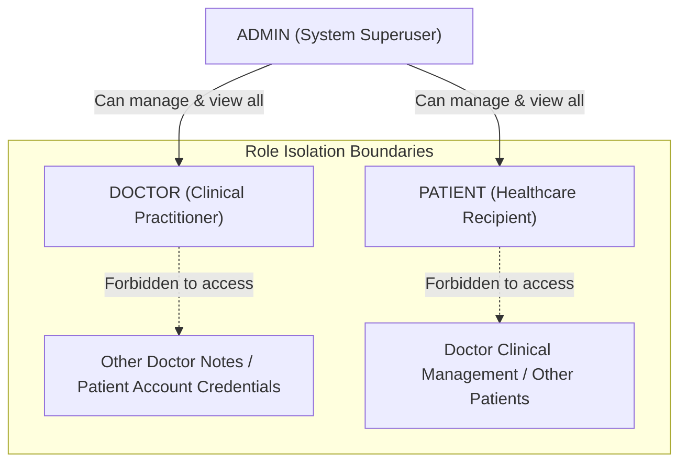

# Authentication & Role-Based Access Control (RBAC)

## Architecture & Session Strategy

The application uses a secure, database-backed session token strategy designed for resilience across serverless functions and modern browsers:

1. **Password Hashing (`src/lib/password.ts`)**:
   - Uses `bcryptjs` with 12 salt rounds (`bcrypt.genSalt(12)`).
   - Plaintext passwords are never stored or logged.
   - Enforces password complexity during registration via Zod: minimum 8 characters, at least 1 uppercase letter, and at least 1 number.

2. **Session Persistence (`src/auth/session.ts`)**:
   - On successful login or registration, a cryptographically random 32-byte hexadecimal string is generated using `crypto.randomBytes(32).toString("hex")`.
   - The token is persisted in the PostgreSQL `Session` table with an expiration timestamp set to 7 days from generation (`SESSION_EXPIRY_DAYS = 7`).
   - The token is transmitted to the browser in the `healthcare_session` cookie with strict security flags:
     - `httpOnly: true` (prevents client-side JavaScript access / XSS leakage).
     - `secure: true` in production (enforces HTTPS transmission).
     - `sameSite: "lax"` (protects against CSRF while enabling cross-site GET navigations, essential for Google OAuth redirects).
     - `path: "/"`

---

## User Roles & Hierarchy

The application defines three strictly isolated roles:



### 1. `PATIENT`
- **Main Pages**: `/patient/dashboard`, `/doctors` (search & booking), `/login`, `/register`.
- **Permissions**:
  - Search doctors and inspect real-time available consultation slots.
  - Book consultation slots with symptom submissions.
  - Reschedule and cancel own appointments.
  - View prescriptions, clinical notes, and AI-generated post-visit summaries for own consultations.
- **Restricted Operations**:
  - Cannot access doctor dashboards, modify doctor schedules, create doctor accounts, or view appointments of other patients.

### 2. `DOCTOR`
- **Main Pages**: `/doctor/dashboard`.
- **Permissions**:
  - Configure weekly working hours (e.g. 10:00 to 18:00) and slot duration.
  - Schedule planned leaves and absences.
  - View daily patient queue with AI pre-visit clinical triage briefings.
  - Document clinical notes and prescribe structured medications with dosage and frequency.
  - Connect Google Calendar via OAuth 2.0 to sync appointments.
- **Restricted Operations**:
  - Cannot modify schedules, leaves, or clinical notes of other doctors. Cannot create new doctor accounts.

### 3. `ADMIN`
- **Main Pages**: `/admin/dashboard`, `/doctor/dashboard`, `/patient/dashboard`.
- **Permissions**:
  - Create and configure new doctor profiles (specialization, default working hours, slot duration).
  - Manage and inspect all appointments, doctors, and patient profiles across the system.
  - Access system diagnostics (`/api/admin/email-diagnostics`) to verify transactional email delivery.
- **Restricted Operations**:
  - Regular users cannot register as Admin via public registration (Admin accounts are seeded or provisioned directly).

---

## Server-Side Authorization Guards (`src/auth/rbac.ts`)

Authorization is verified at the service and route layer through composable guard functions:

```ts
// Require authenticated user (any role)
const user = await requireAuth();

// Require specific roles
const patient = await requirePatient();
const doctor = await requireDoctor();
const admin = await requireAdmin();

// Resource ownership assertion (prevents IDOR vulnerabilities)
assertResourceOwnership(resourceUserId, currentUser);
assertDoctorOwnership(doctorId, currentUser);
```

If a user attempts an unauthorized action, `ForbiddenError` (HTTP 403) or `UnauthorizedError` (HTTP 401) is raised and formatted into a clean JSON error response by `handleApiError`.
