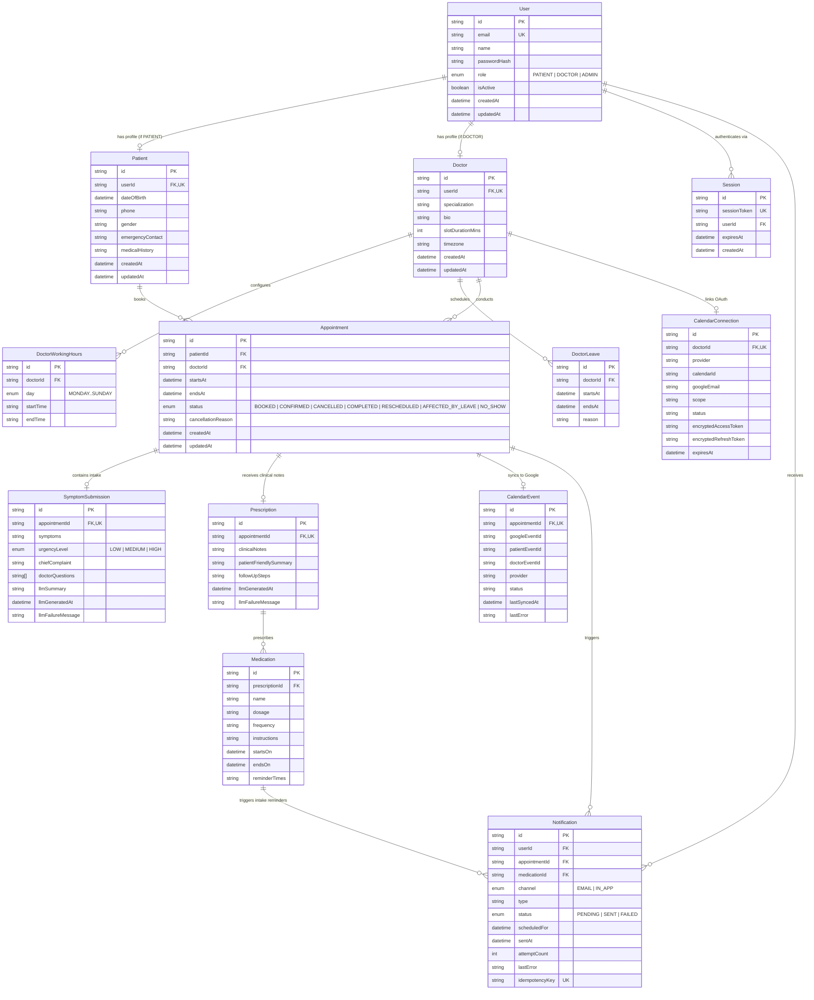

# Database Documentation

## Technology & ORM
- **Engine**: PostgreSQL 16 (Hosted on Neon Serverless Postgres in Production / Local PostgreSQL in Development)
- **Object-Relational Mapping (ORM)**: Prisma ORM (`@prisma/client` v6.19.2)
- **Schema Location**: `prisma/schema.prisma`

---

## Entity Relationship (ER) Diagram

---

## Detailed Model Catalog

### 1. `User`
- **Purpose**: Core identity record for all system actors.
- **Fields**: `id` (cuid PK), `email` (unique), `name`, `passwordHash` (bcrypt hash), `role` (enum: `PATIENT`, `DOCTOR`, `ADMIN`), `isActive` (boolean, default `true`), `createdAt`, `updatedAt`.
- **Relations**: 1:1 with `Patient`, 1:1 with `Doctor`, 1:N with `Session`, 1:N with `Notification`.

### 2. `Session`
- **Purpose**: Database-backed user session tokens.
- **Fields**: `id` (cuid PK), `sessionToken` (unique 32-byte hex string), `userId` (FK -> `User.id`, cascade delete), `expiresAt` (datetime), `createdAt`.
- **Indexes**: `@@index([userId])`, `@@index([sessionToken])`.

### 3. `Patient`
- **Purpose**: Medical profile and demographics for patients.
- **Fields**: `id` (cuid PK), `userId` (FK -> `User.id`, unique, cascade delete), `dateOfBirth`, `phone`, `gender`, `emergencyContact`, `medicalHistory`, `createdAt`, `updatedAt`.
- **Relations**: 1:N with `Appointment`.

### 4. `Doctor`
- **Purpose**: Clinical profile, consultation settings, and timezone.
- **Fields**: `id` (cuid PK), `userId` (FK -> `User.id`, unique, cascade delete), `specialization` (e.g. Cardiology, Neurology), `bio`, `slotDurationMins` (int, default `30`), `timezone` (default `"Asia/Kolkata"`), `createdAt`, `updatedAt`.
- **Indexes**: `@@index([specialization])`.
- **Relations**: 1:N with `DoctorWorkingHours`, 1:N with `DoctorLeave`, 1:N with `Appointment`, 1:1 with `CalendarConnection`.

### 5. `DoctorWorkingHours`
- **Purpose**: Recurring weekly schedule defining doctor availability per day of week.
- **Fields**: `id` (cuid PK), `doctorId` (FK -> `Doctor.id`, cascade delete), `day` (enum `MONDAY`..`SUNDAY`), `startTime` (`"HH:MM"` 24hr string, e.g. `"10:00"`), `endTime` (`"HH:MM"` 24hr string, e.g. `"18:00"`).
- **Constraints**: `@@unique([doctorId, day])` prevents duplicate schedule entries for the same weekday.

### 6. `DoctorLeave`
- **Purpose**: Planned absences and leave intervals for doctors.
- **Fields**: `id` (cuid PK), `doctorId` (FK -> `Doctor.id`, cascade delete), `startsAt` (UTC timestamp), `endsAt` (UTC timestamp), `reason` (optional description), `createdAt`, `updatedAt`.
- **Indexes**: `@@index([doctorId, startsAt, endsAt])`.

### 7. `Appointment`
- **Purpose**: Central consultation booking record between patient and doctor.
- **Fields**: `id` (cuid PK), `patientId` (FK -> `Patient.id`), `doctorId` (FK -> `Doctor.id`), `startsAt` (UTC timestamp), `endsAt` (UTC timestamp), `status` (enum: `BOOKED`, `CONFIRMED`, `CANCELLED`, `COMPLETED`, `RESCHEDULED`, `AFFECTED_BY_LEAVE`, `NO_SHOW`), `cancellationReason`, `createdAt`, `updatedAt`.
- **Constraints & Indexes**:
  - `@@unique([doctorId, startsAt])`: Database-level protection guaranteeing no two appointments can start at the exact same time for the same doctor.
  - `@@index([doctorId, startsAt, endsAt])`: High-speed index for availability and conflict overlap queries.
  - `@@index([patientId, startsAt])`: Index for patient booking lists.

### 8. `SymptomSubmission`
- **Purpose**: Pre-visit patient intake, chief complaint, and LLM triage summary.
- **Fields**: `id` (cuid PK), `appointmentId` (FK -> `Appointment.id`, unique, cascade delete), `symptoms` (raw patient input), `urgencyLevel` (enum: `LOW`, `MEDIUM`, `HIGH`), `chiefComplaint` (AI extracted), `doctorQuestions` (string array of 3 suggested clinical inquiries), `llmSummary` (AI generated briefing), `llmGeneratedAt`, `llmFailureMessage`.

### 9. `Prescription`
- **Purpose**: Post-consultation clinical notes, patient summary, and follow-up steps.
- **Fields**: `id` (cuid PK), `appointmentId` (FK -> `Appointment.id`, unique, cascade delete), `clinicalNotes` (doctor's authoritative medical text), `patientFriendlySummary` (AI simplified explanation), `followUpSteps` (AI extracted action items), `llmGeneratedAt`, `llmFailureMessage`.

### 10. `Medication`
- **Purpose**: Structured prescribed medications with schedule and reminder parameters.
- **Fields**: `id` (cuid PK), `prescriptionId` (FK -> `Prescription.id`, cascade delete), `name`, `dosage`, `frequency` (e.g. "Twice daily", "Once at bedtime"), `instructions`, `startsOn`, `endsOn`, `reminderTimes` (e.g. "08:00, 20:00").

### 11. `Notification`
- **Purpose**: Transactional email and reminder delivery log with status tracking.
- **Fields**: `id` (cuid PK), `userId` (FK -> `User.id`), `appointmentId` (FK -> `Appointment.id`, nullable), `medicationId` (FK -> `Medication.id`, nullable), `channel` (enum: `EMAIL`, `IN_APP`), `type` (e.g. `"BOOKING_CONFIRMATION"`, `"MEDICATION_REMINDER"`, `"LEAVE_CONFLICT"`), `status` (enum: `PENDING`, `SENT`, `FAILED`), `scheduledFor`, `sentAt`, `attemptCount` (default 0), `lastError`, `idempotencyKey` (unique string).
- **Indexes**: `@@index([status, scheduledFor])`, `@@index([appointmentId])`, `@@index([userId])`, `@@index([idempotencyKey])`.

### 12. `CalendarConnection` & `CalendarEvent`
- **Purpose**: Google OAuth tokens and synchronized calendar events.
- **Fields (`CalendarConnection`)**: `id` (cuid PK), `doctorId` (FK -> `Doctor.id`, unique), `provider` (default `"GOOGLE"`), `googleEmail`, `scope`, `status` (`"CONNECTED"`, `"REVOKED"`, `"DISCONNECTED"`), `encryptedAccessToken`, `encryptedRefreshToken`, `expiresAt`.
- **Fields (`CalendarEvent`)**: `id` (cuid PK), `appointmentId` (FK -> `Appointment.id`, unique), `googleEventId`, `provider`, `status` (`"SYNCED"`, `"FAILED"`, `"NOT_CONNECTED"`), `lastSyncedAt`, `lastError`.

---

## Key Architectural Database Decisions
1. **Preservation of Raw Medical Input**: AI outputs (`llmSummary`, `patientFriendlySummary`) are stored side-by-side with original human medical inputs (`symptoms`, `clinicalNotes`) so clinical auditability is never lost.
2. **Soft Conflict Transitioning**: Appointments conflicting with doctor leave are transitioned to `AFFECTED_BY_LEAVE` rather than deleted, preserving medical history and patient contact details.
3. **Idempotency Keys for Notifications**: `Notification.idempotencyKey` prevents duplicate transactional emails and reminder dispatches.
