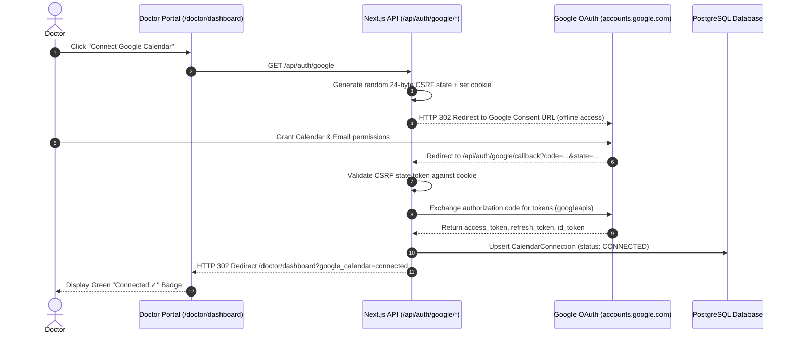

# Google Calendar Integration & OAuth 2.0

## Overview

The Google Calendar integration allows attending doctors to synchronize clinical consultations directly with their personal or institutional Google Calendar in real-time. The system implements OAuth 2.0 authorization with offline access, enabling automatic calendar event creation, rescheduling updates, and cancellations without requiring the doctor to be logged in during patient actions.

---

## OAuth 2.0 Connection Architecture



---

## Required Permissions & Scopes

The integration requests two scopes from Google Cloud Console:
1. `https://www.googleapis.com/auth/calendar.events` (Read/write access to manage consultation calendar entries).
2. `https://www.googleapis.com/auth/userinfo.email` (Used to display the doctor's connected Google email address in the dashboard).

---

## Event Lifecycle Management

### 1. Appointment Creation (`src/lib/google/calendar.ts`)
- When a patient books an appointment, the system checks if the assigned doctor has an active `CalendarConnection`.
- If connected, it creates a Google Calendar event containing:
  - **Summary**: `Consultation: <Patient Name> with Dr. <Doctor Name>`
  - **Description**: Patient chief complaint, symptoms overview, and system reference ID.
  - **Time Range**: `startsAt` to `endsAt` in UTC format.
- The returned Google Event ID is stored in `CalendarEvent.googleEventId` with `status: "SYNCED"`.

### 2. Appointment Rescheduling
- When an appointment is rescheduled, the system executes `calendar.events.patch` to update the event's start and end times, preserving the original event link.

### 3. Appointment Cancellation
- When an appointment is cancelled, the system executes `calendar.events.delete`, removing the consultation from the doctor's Google Calendar.

### 4. Automatic Token Refresh
- Prior to executing any Google Calendar API call, `getAuthenticatedClientForDoctor(doctorId)` checks if the access token is expired or within 2 minutes of expiry.
- If expired, it automatically calls `oauth2Client.refreshAccessToken()` using the stored `encryptedRefreshToken` and updates the database with the fresh access token.

---

## Google Cloud Console Configuration Guide

1. Navigate to **[Google Cloud Console](https://console.cloud.google.com/)**.
2. Create or select a project (e.g. `Healthcare Appointment Manager`).
3. Enable the **Google Calendar API** under **APIs & Services** ➔ **Enabled APIs**.
4. Configure the **OAuth Consent Screen**:
   - User Type: **External**.
   - App Name: `Healthcare Appointment Manager`.
   - Scopes: Add `.../auth/calendar.events` and `.../auth/userinfo.email`.
5. Create an **OAuth 2.0 Client ID** (Web application):
   - **Authorized JavaScript Origins**:
     - `http://localhost:3000` (Local)
     - `https://healthcare-appointment-manager.vercel.app` (Production)
   - **Authorized Redirect URIs**:
     - `http://localhost:3000/api/auth/google/callback` (Local)
     - `https://healthcare-appointment-manager.vercel.app/api/auth/google/callback` (Production)
6. Add the credentials to your environment variables:
   ```env
   GOOGLE_CLIENT_ID="<your-client-id>.apps.googleusercontent.com"
   GOOGLE_CLIENT_SECRET="<your-client-secret>"
   GOOGLE_REDIRECT_URI="https://healthcare-appointment-manager.vercel.app/api/auth/google/callback"
   ```

---

## Fault Tolerance & Zero-Rollback Guarantee

Google Calendar synchronization runs as an asynchronous, non-blocking operation:
- If a doctor's Google token is revoked, or if Google's servers time out, the failure is caught and logged in `CalendarEvent.lastError` (`status: FAILED`).
- **The underlying appointment booking, reschedule, or cancellation is never rolled back.**
